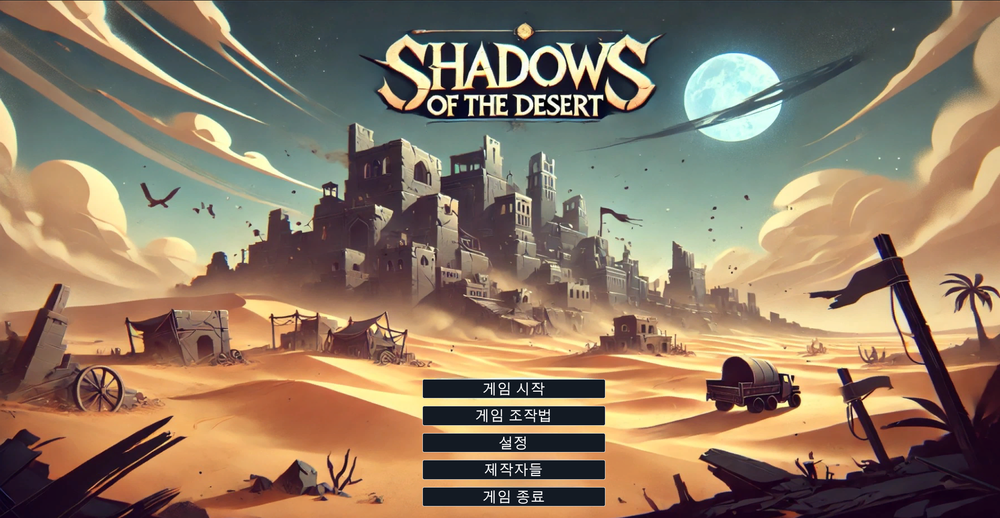
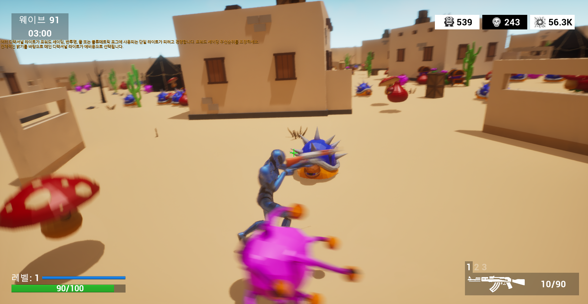
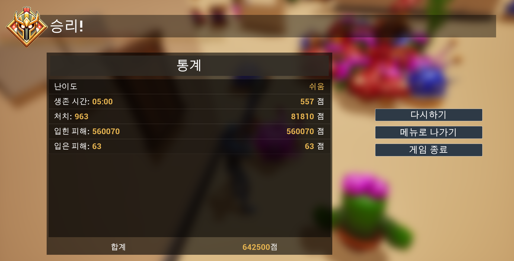

# Shadows of the Desert

## 🏜 프로젝트 소개

### 프로젝트 개요

**Shadows of the Desert**는 황량한 사막에서 생존하며 몰려오는 적들을 상대하는 **3D 슈팅 게임**입니다. 언리얼 엔진을 기반으로 제작되었으며, 빠른 템포의 전투와 다양한 무기 시스템을 제공합니다.

### 주요 기능 요약

- **긴장감 넘치는 슈팅 게임**: 사방에서 몰려오는 적을 상대하며 생존하는 게임 플레이
- **다양한 무기 시스템**: 여러 종류의 무기를 전략적으로 활용 가능
- **언리얼 엔진 5 기반**: 카툰풍 그래픽과 최적화된 게임 플레이 경험
- **직관적인 UI**: 플레이어가 쉽게 게임을 이해하고 조작할 수 있도록 설계
- **적 AI 시스템**: AI가 순찰하고 플레이어를 추격하며 공격하는 기능

## 🛠 개발 환경

- **언리얼 엔진**: Unreal Engine 5.5.3
- **프로그래밍 언어**: C++
- **IDE 및 개발 도구**:
  - Visual Studio 2022
  - Unreal Engine Editor
- **버전 관리**: Git & GitHub
- **개발 기간**: 2025.02.17 ~ 2025.03.07

## 🔧 빌드 및 실행 방법

1. 언리얼 엔진 5.5.3을 설치합니다.
2. 프로젝트를 클론합니다:
   ```sh
   git clone https://github.com/your-repository/ShadowsOfTheDesert.git
   ```
3. 언리얼 엔진에서 `.uproject` 파일을 엽니다.
4. `Build` 버튼을 눌러 프로젝트를 빌드합니다.
5. `Play` 버튼을 눌러 게임을 실행합니다.

## 📂 프로젝트 구조


## 🏹 게임 플레이 방법

- **이동**: WASD 키
- **사격**: 마우스 좌클릭
- **무기 변경**: 숫자 키 (1 - 라이플, 2 - 스나이퍼, 3 - 로켓런처)
- **재장전**: R 키
- **달리기**: Shift 키
- **점프**: Space 키

## 🏗 주요 클래스 및 로직 설명

### 1. 플레이어 캐릭터 시스템

- `Shadow_of_the_DesertCharacter.cpp`
  - 기본적인 이동 및 조작 구현 (WASD 이동, 점프, 달리기)
  - 무기 변경 기능 (`Swap_Rifle`, `Swap_Sniper`, `Swap_Rocket`)
  - 무기 장착 시 탄약 상태 유지 (`EquipWeapon`)
  - 대미지 처리 (`TakeDamage`), 사망 시 게임 종료 연계
  - `Enhanced Input System`을 활용한 입력 처리 (`SetupPlayerInputComponent`)

### 2. 적 AI 시스템

- `EnemyCharacterAi.cpp`
  - AI 상태 관리 (순찰, 감지, 공격, 사망)
  - 플레이어 감지 및 추격 (`OnPerceptionUpdated` 사용)
  - 공격 충돌 감지 (`OnHit`)
  - 피격 시 피드백 제공 (히트마커, 데미지 UI)
- `EnemyAIController.cpp`
  - AI의 상태 전환 및 행동 제어
  - 특정 행동 패턴 설정 (순찰, 전투 모드 전환)
- `PatrolPath.cpp`
  - AI가 지정된 경로를 따라 이동하도록 구현
  - `GetWayPoint()`를 사용하여 경로를 설정함

### 3. 무기 및 탄환 시스템

- `WeaponBase.cpp`
  - 무기의 기본 구조 (공격, 재장전, 탄환 개수 등)
  - `Attack()` 함수로 발사 구현
  - `Reload()` 함수로 재장전 기능 추가
- **각 무기의 특징**
  - `Rifle.cpp`: 연사 속도가 빠르고 정확한 라이플
  - `Sniper.cpp`: 단발 데미지가 강하며, 줌 기능 제공
  - `RocketLauncher.cpp`: 폭발 범위 공격 무기
- **탄환 시스템**
  - `NomalBullet.cpp`: 기본 단일 타겟 탄환
  - `PiercingBullet.cpp`: 적을 관통하는 탄환
  - `ExplosiveBullet.cpp`: 일정 범위에 폭발 피해를 주는 탄환

### 4. UI 및 HUD 시스템

- `CustomHUD.cpp`
  - 조준선, 히트마커, 킬마커 표시 기능 포함
  - `ShowHitmarker()`, `ShowKillmarker()` 함수로 적중 및 처치 시 UI 반영
- `DamageTextWidget.cpp`
  - 적이 맞았을 때 화면에 데미지 수치를 표시
  - `SetDamageText()`를 통해 동적으로 데미지 표시 업데이트

### 5. 게임 상태 및 스코어링 시스템

- `Shadow_of_the_DesertGameInstance.cpp`
  - 게임 전반의 데이터를 저장 및 관리
  - 플레이어의 총 점수, 라운드 진행 상황 추적
- `Shadow_of_the_DesertGameState.cpp`
  - 웨이브 기반 점수 관리 및 적 카운트 추적
  - `KillEnemy()`를 호출하여 점수 증가 처리

## 🌟 추가 구현 사항
- **UI 및 게임 흐름 개선**:
  - **이재성 & 이경민**
    - **이경민**: 버튼 기능 연결 및 상호작용 구현
    - **이재성**:
   

⬇ **메인 메뉴 화면 및 버튼 추가** ⬇


⬇ **조작법 UI 구현** ⬇ 


⬇ **일시정지 화면 추가** ⬇ 


⬇ **게임 클리어 & 게임 오버 화면 추가** ⬇ 


## ⚠️ 주의사항

- 프로젝트는 **언리얼 엔진 5.5.3** 버전에 최적화되어 있습니다. 다른 버전에서는 정상 작동하지 않을 수 있습니다.
- 그래픽 설정이 높은 경우 낮은 사양의 PC에서는 렉이 발생할 수 있습니다.
- **알려진 버그**:
  - 특정 구역에서 로켓런처를 발사하면 적에게 데미지가 들어가지 않음
  - 데미지 텍스트 애니메이션이 전체화면에서만 정상적으로 표시되며, 그렇지 않은 경우 위치가 어긋남

## 👥 팀원 소개

- **김영빈**: Enemy 시스템 담당
- **문정수**: Character 시스템 담당
- **정찬효**: Weapon 시스템 담당
- **이재성**: UI 시스템 담당
- **이경민**: GameMode 담당

## 🎮 게임 스크린샷

### 메인 메뉴


### 게임 플레이


### 결과 창


---

**Shadows of the Desert**를 플레이해주셔서 감사합니다!
